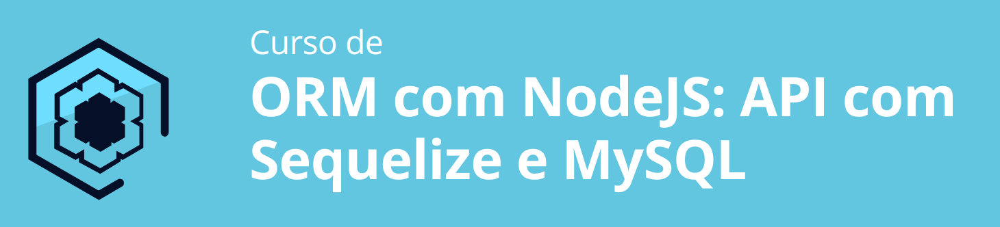

## ORM com NodeJS: API utilizando Sequelize e Mysql.

Este projeto foi desenvolvido a partir de um curso da Alura.



### Estruturando o Ambiente

1. Instalando dependencias nas versões utilizadas no curso (package.json)
    ```
    "dependencies": {
        "body-parser": "^1.19.0",
        "express": "^4.17.1",
        "mysql2": "^2.3.3",
        "path": "^0.12.7",
        "sequelize": "^5.21.7",
        "sequelize-cli": "^5.5.1"
    },
    "devDependencies": {
        "nodemon": "^2.0.3"
    ```
2. Configurando o projeto para reload automático com o nodemon (package.json)
    ```
    "scripts": {
        "dev": "nodemon ./api/index.js",
    ```
3. Configurando uma api de teste na porta 3000
4. Para instalar as dependências
    ```
    npm install
    ```
5. Para Rodar o Projeto
    ```
    npm rum dev
    ```
6. Configurando a conexão com Mysql

